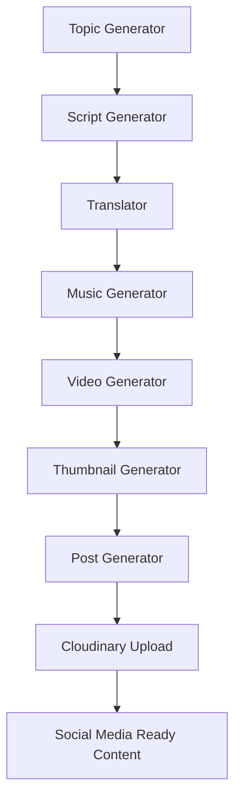

# 🤖 AI Content Automation System


An automated **AI-powered content generation system built with Python** that creates scripts, videos, thumbnails and social media posts automatically.

Sistema automatizado de **generación de contenido con Inteligencia Artificial desarrollado en Python**, capaz de crear guiones, videos, miniaturas y publicaciones para redes sociales de forma automática.

---

# 🚀 Features / Características

### 🧠 AI Topic Generator

Automatically generates trending topics for content creation.

Genera automáticamente ideas de contenido basadas en tendencias.

---

### ✍️ Script Generator

Creates scripts for videos and social media posts using AI.

Genera guiones automáticamente para videos y contenido digital.

---

### 🌍 Translator

Translates generated content into different languages.

Permite traducir el contenido generado a diferentes idiomas.

---

### 🎵 Background Music Generator

Creates background music for videos automatically.

Genera música de fondo automáticamente para los videos.

---

### 🎬 Video Generator

Builds videos automatically using:

• Generated script
• Background music
• Visual elements

Crea videos automáticamente usando:

• Guiones generados
• Música de fondo
• Recursos visuales

---

### 🖼 Thumbnail Generator

Creates thumbnails optimized for social media platforms.

Genera miniaturas optimizadas para redes sociales.

---

### 📲 Social Media Post Generator

Automatically generates captions and posts for:

• Instagram
• LinkedIn
• Short video platforms

Genera publicaciones automáticas para:

• Instagram
• LinkedIn
• Plataformas de videos cortos

---

### ☁️ Cloudinary Upload

Uploads generated videos to Cloudinary for hosting and distribution.

Sube automáticamente los videos generados a Cloudinary.

---

### ⏰ Scheduler Automation

Allows the system to run automatically using scheduled tasks.

Permite ejecutar el sistema automáticamente mediante tareas programadas.

---

# 🧠 AI Content Generation Pipeline

The system automatically generates content through a modular AI pipeline.

El sistema genera contenido automáticamente mediante un pipeline modular de IA.



---

# 🏗 Project Structure / Estructura del Proyecto

```
ai_content_system
│
├── main.py
├── config.py
├── utils.py
│
├── topic_generator.py
├── script_generator.py
├── translator.py
│
├── music_generator.py
├── video_generator.py
├── thumbnail_generator.py
│
├── post_generator.py
├── linkedin_instagram_post.py
│
├── cloudinary_upload.py
├── calendar_generator.py
│
├── shorts_generator.py
├── scheduler.py
│
├── requirements.txt
└── start.sh
```

---

# ⚙️ Installation / Instalación

### 1️⃣ Clone the repository

```
git clone https://github.com/YOUR_USERNAME/ai_content_system.git
```

```
cd ai_content_system
```

---

### 2️⃣ Install dependencies

```
pip install -r requirements.txt
```

---

### 3️⃣ Configure environment variables

Create a `.env` file in the root directory.

Crea un archivo `.env` en la carpeta principal.

```
OPENAI_API_KEY=your_openai_key
CLOUDINARY_API_KEY=your_cloudinary_key
CLOUDINARY_SECRET=your_cloudinary_secret
```

---

# ▶️ Run the System / Ejecutar el sistema

```
python main.py
```

The system will automatically:

1️⃣ Generate topic
2️⃣ Create script
3️⃣ Translate content
4️⃣ Generate music
5️⃣ Create video
6️⃣ Generate thumbnail
7️⃣ Upload video

El sistema automáticamente:

1️⃣ Genera el tema
2️⃣ Crea el guion
3️⃣ Traduce el contenido
4️⃣ Genera música
5️⃣ Crea el video
6️⃣ Genera miniatura
7️⃣ Sube el video

---

# 📦 Technologies Used / Tecnologías Utilizadas

• Python
• OpenAI API
• MoviePy
• Cloudinary
• FFmpeg
• AI Content Generation
• Automation Pipelines

---

# 🎯 Use Cases / Casos de Uso

This system can be used for:

• YouTube automation
• TikTok automation
• Instagram reels automation
• AI marketing agencies
• Content creators
• Automated social media pages

Este sistema puede utilizarse para:

• Automatización de contenido
• Automatización de YouTube
• Automatización de TikTok
• Reels de Instagram
• Automatización de marketing

---

# 🔮 Future Improvements / Mejoras Futuras

Possible future improvements:

• Automatic YouTube upload
• TikTok API integration
• AI voice generation
• Multi-language video support
• Advanced video editing

Posibles mejoras futuras:

• Subida automática a YouTube
• Integración con TikTok API
• Generación de voz con IA
• Soporte multi idioma
• Edición avanzada de video

---

# 👨‍💻 Author / Autor

Developed by **Yassir Technologic**

AI developer focused on automation systems, AI tools and content generation.

GitHub
https://github.com/yassirtecnologic

---

# ⭐ Support

If you find this project useful, consider giving it a **star ⭐ on GitHub**.

